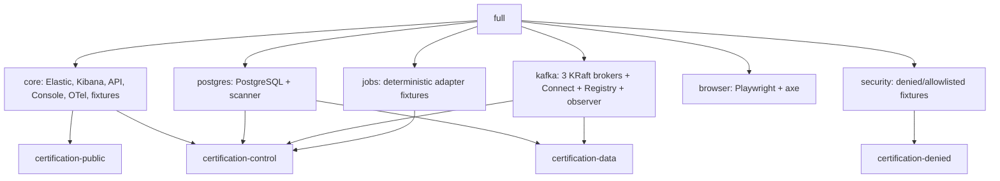
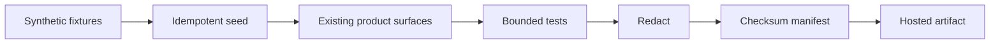
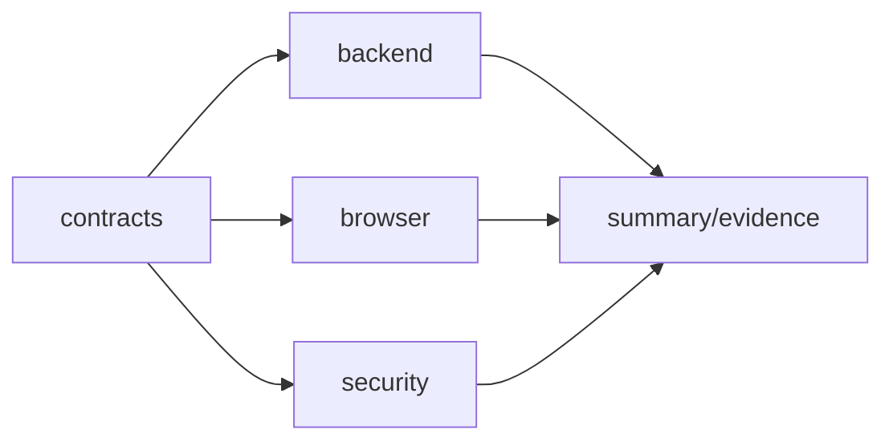
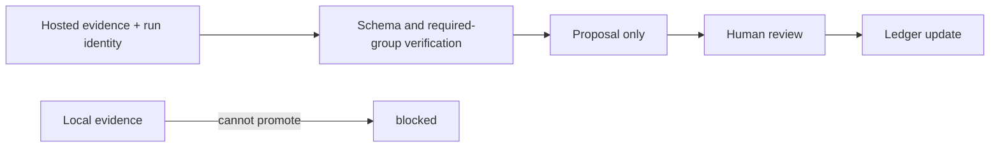

# DataObs product certification harness

The harness consolidates existing service entry points into profiles: `core`, `postgres`, `kafka`, `jobs`, `browser`, `security`, and `full`. Run `./scripts/certification/compose.sh config`, `up core|full`, `seed`, `test backend|browser|security`, `evidence`, and `down`.

> The certification environment proves only the capabilities and dimensions listed in its retained evidence manifest. It does not make DataObs as a whole production-ready.

Fixtures contain no personal or real business data. Airflow/dbt/Spark fixtures prove parser/emitter contracts only; real providers are not certified. Connector credentials never enter API/Console/browser containers. Four sentinel classes are injected only at runtime, and any occurrence in retained output fails verification.
