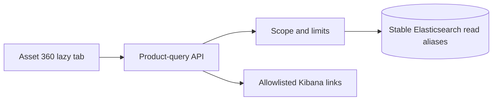

# Asset 360

Asset 360 aggregates scoped projections rather than raw source or Elasticsearch documents. Every section reports status, observation time, source coverage, confidence, warnings and evidence. Usage and cost return `not_configured` when collectors are absent.

DataObs Pathway Explorer explains how data travels and where reliability degrades. Asset 360 explains the complete operational state and impact of one data or platform entity. Kibana remains the deep investigation surface.

## Completion-gate rendering rule

The Console renders allowlisted, typed fields as facts and evidence cards. It never makes arbitrary Elasticsearch documents or raw JSON the primary experience. A missing projection is represented as `not_configured`, `partial`, `stale`, `unknown`, or `unavailable`; missing cost and usage are never converted to zero.
