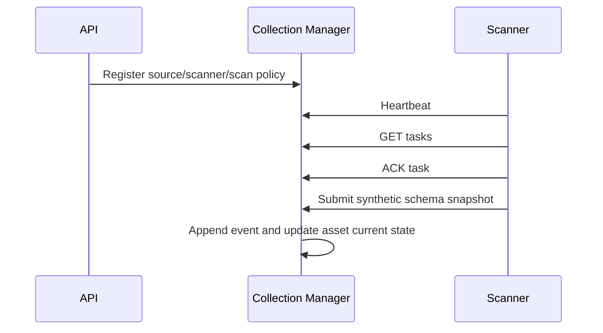

# Collection Manager

The initial control plane supports tenant-aware source, integration, collector, scanner, heartbeat, scan-policy, task, acknowledgement, and idempotent result APIs. Fleet and EDOT adapters intentionally return `not_implemented`.
