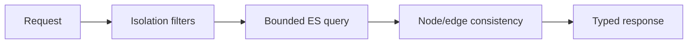

# Console API query layer

`services/product_query` is the read boundary between HTTP routes and Elasticsearch. Every shared-index query begins with tenant and environment predicates. Missing summary projections return `unknown` and incomplete `data_status`, never fabricated zeroes.

