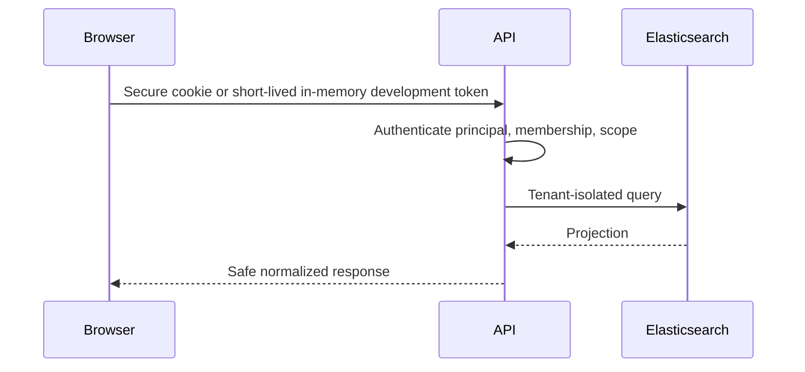

# Console authentication boundary

```mermaid
sequenceDiagram
 Browser->>API: Secure cookie or short-lived in-memory development token
 API->>API: Authenticate principal, membership, scope
 API->>Elasticsearch: Tenant-isolated query
 Elasticsearch-->>API: Projection
 API-->>Browser: Safe normalized response
```

Long-lived tokens are never stored in `localStorage`. Server enforcement remains authoritative even when the UI hides unavailable actions.
