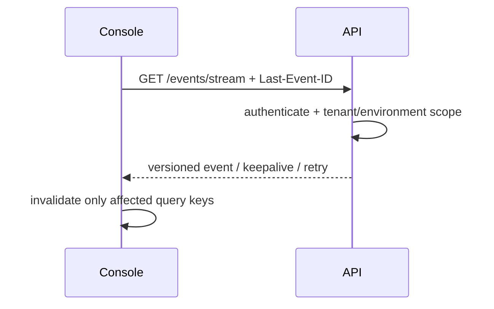

# Console live updates

The foundation supplies versioned keepalive and reconnect framing. Durable bounded event replay and backpressure metrics are intentionally called out as incomplete and keep the PR in draft.
