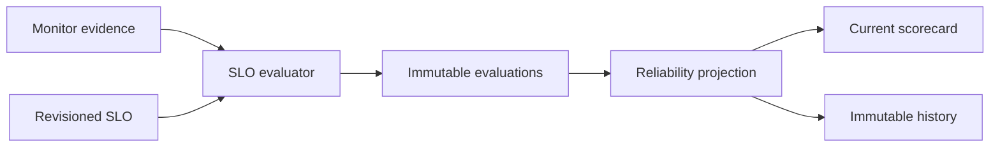

# Data Product SLO and reliability architecture

Definitions are tenant/environment scoped and revisioned with ETags. Evaluations are immutable and deterministic for a definition revision and window; future, missing, unavailable, or stale evidence never passes.

Reliability is `sum(score × weight) / sum(observed non-stale weights)`. Confidence is observed weight divided by configured positive weight. Missing and stale components are separate, and zero observed weight produces an unknown score rather than healthy.
