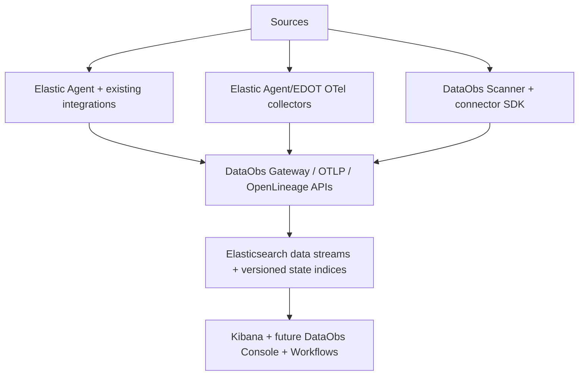

# DataObs Agent and Collection Plane Architecture

Phase 0 establishes the collection-plane boundary. DataObs does **not** fork Elastic Agent and does not create a second host-monitoring agent. The product-facing **DataObs Agent** is a coordinated collection experience composed of Elastic Agent/Fleet, Elastic Agent as EDOT or standalone EDOT collectors, and the DataObs Scanner for active metadata, quality, freshness, profiling, and lineage collection.



## Collection hierarchy

1. **Reuse Elastic Agent and existing Elastic integrations** for hosts, OS, Kubernetes, cloud, databases, brokers, logs, custom HTTP/API/CEL/SQL/Kafka/object-storage inputs, their assets, pipelines, dashboards, data streams, mappings, and Fleet policy management.
2. **Use Elastic Agent as EDOT Collector or standalone EDOT** for OTLP logs, metrics, traces, application instrumentation, messaging spans, host/Kubernetes OTel receivers, gateways, custom receivers, and aggregation.
3. **Build DataObs Scanner connectors** only for DataObs-specific active scanning that packaged integrations and OTel receivers do not provide: schema snapshots, schema diffing, freshness, quality, profiling, query history, asset/catalog updates, OpenLineage events, and scan telemetry.

## DataObs Collection Manager

The Collection Manager is a control-plane capability, not a Fleet replacement. It inventories collectors and scanners, records version, health, capability, tenant, environment, and location, maps integration requests to either an Elastic integration, EDOT configuration, or a DataObs Scanner connector, applies Fleet policies through supported Fleet APIs, generates standalone EDOT config where Fleet is not used, assigns scanner tasks, and stores desired state separately from observed state.

Desired state lives in versioned indices and aliases such as `dataobs-collector-desired-state-v1` with alias `dataobs-collector-desired-state-write`; observed state and heartbeats are append-only data streams such as `logs-dataobs.connector_health-default`. Source credentials are always references to secret managers and are never clear text in state indices, generated policies, logs, traces, or Elasticsearch documents. The manager emits its own OpenTelemetry traces, metrics, and audit events for integration and scan-policy changes.

## Elastic Agent / Fleet integration layer

Fleet-managed deployment is the default for supported infrastructure, cloud, database operational, broker, API, log, and file telemetry. Standalone and air-gapped Elastic Agent deployments are supported through generated policies and exported package assets when Fleet is unavailable. DataObs links Elastic data streams to assets, pipelines, owners, and pillars through tenant-aware integration metadata: `tenant.id`, `dataobs.environment`, `dataobs.source.id`, `dataobs.asset.id`, `dataobs.pillar`, and `data_stream.dataset`.

DataObs owns only custom DataObs packages and enrichment pipelines. It must not manually modify installed Elastic-managed package assets. Custom packages use names such as `dataobs_database`, semantic versions, and `dataobs.<capability>` data-stream datasets. Version compatibility is recorded per tenant/integration and checked before policy generation.

## EDOT / OpenTelemetry layer

EDOT runs in agent mode for local collection and gateway mode for aggregation. OTLP ingestion accepts logs, metrics, and traces. Processors enrich telemetry with tenant, environment, ownership, pipeline, asset, and deployment metadata. Standard collector controls include memory limiter, batching, retry queues, persistent buffering where supported, backpressure, and self-observability. Messaging spans follow OpenTelemetry semantic conventions and correlate with OpenLineage using run, job, namespace, dataset, and trace identifiers.

Exporters send telemetry to Elastic OTLP/Elasticsearch endpoints by default; optional exporters are integration-specific and must not weaken Elasticsearch as the system of record.

## DataObs Scanner

The scanner actively collects metadata and data-quality facts that generic infrastructure agents do not provide. It supports local sidecar/host process, container, Kubernetes Deployment, Kubernetes CronJob, centrally scheduled worker, customer-network worker that calls the DataObs control plane outbound, and air-gapped standalone modes. It never requires inbound connectivity from DataObs into a customer network.

The scanner executes deterministic tasks containing tenant, environment, integration/source ID, source system, connector, operation, policy, timeout, concurrency, credential references, and trace correlation. It emits scan heartbeats, scanner execution telemetry, OpenLineage-compatible events, OTel spans/metrics/logs for the scan itself, and DataObs result documents.

## DataObs Connector SDK

The connector contract preserves these capabilities:

```python
class DataObsConnector(Protocol):
    def capabilities(self) -> ConnectorCapabilities: ...
    def test_connection(self) -> ConnectionTestResult: ...
    def discover(self, request: DiscoveryRequest) -> DiscoveryResult: ...
    def schema_snapshot(self, request: SchemaScanRequest) -> SchemaSnapshot: ...
    def freshness(self, request: FreshnessRequest) -> FreshnessResult: ...
    def profile(self, request: ProfileRequest) -> ProfileResult: ...
    def quality(self, request: QualityRequest) -> QualityResult: ...
    def lineage(self, request: LineageRequest) -> LineageResult: ...
    def query_history(self, request: QueryHistoryRequest) -> QueryHistoryResult: ...
    def checkpoint(self) -> ConnectorCheckpoint: ...
    def close(self) -> None: ...
```

Every result carries tenant ID, environment, integration/source ID, connector name/version, execution ID, task ID, started/ended timestamp, source system, asset identity, schema version, status, error category, and correlation/trace ID.

## DataObs Gateway

Remote collectors and scanners send OTLP, OpenLineage events, catalog snapshots, quality results, scan status, heartbeats, and workflow/remediation results through authenticated gateway endpoints. Authentication supports API keys, workload identity/OIDC, mTLS for enterprise deployments, and short-lived scoped tokens. Tenancy is explicit in tokens and payloads. Writes are idempotent by deterministic task/execution/result IDs. Payloads support compression, batching, retry hints, and backpressure responses.

## Storage contracts

Append-only data streams: `logs-dataobs.scanner_execution-*`, `logs-dataobs.schema_snapshot-*`, `logs-dataobs.schema_change-*`, `metrics-dataobs.freshness-*`, `metrics-dataobs.table_profile-*`, `metrics-dataobs.column_profile-*`, `logs-dataobs.quality_result-*`, `logs-dataobs.query_history-*`, and `metrics-dataobs.connector_health-*`.

Mutable state uses versioned indices plus read/write aliases: `dataobs-source-definitions-v1`, `dataobs-integration-config-v1`, `dataobs-scan-policies-v1`, `dataobs-asset-current-state-v1`, `dataobs-ownership-v1`, `dataobs-connector-registrations-v1`, and `dataobs-collector-desired-state-v1`.
