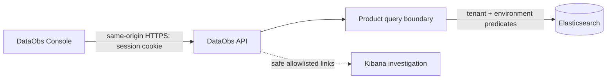
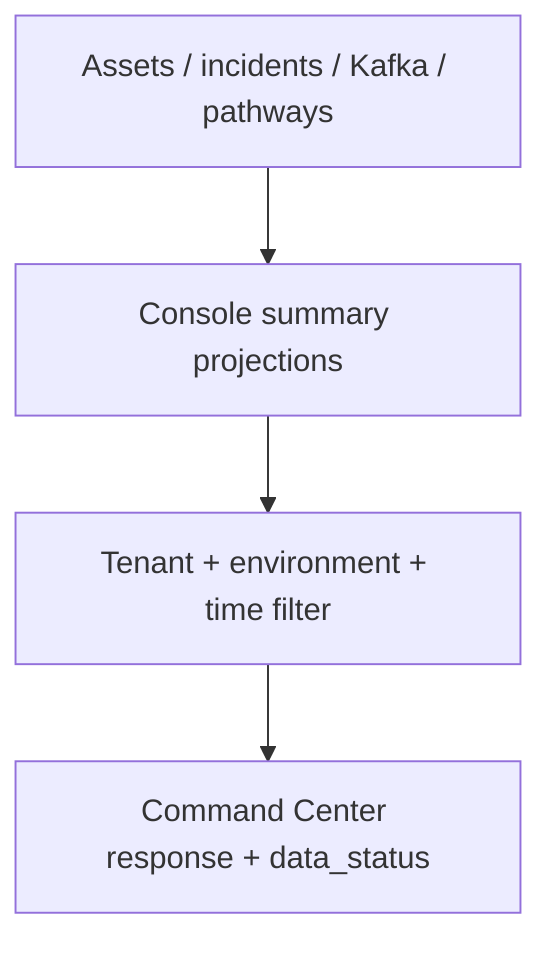

# DataObs Console architecture

> DataObs Console is the guided product experience. Kibana remains the deep investigation and administration surface.

The browser never calls Elasticsearch or Kibana APIs and never persists production credentials. Command Center uses bounded server projections; Data Flow requests at most 1,000 nodes and 2,500 edges and distinguishes inferred evidence.

