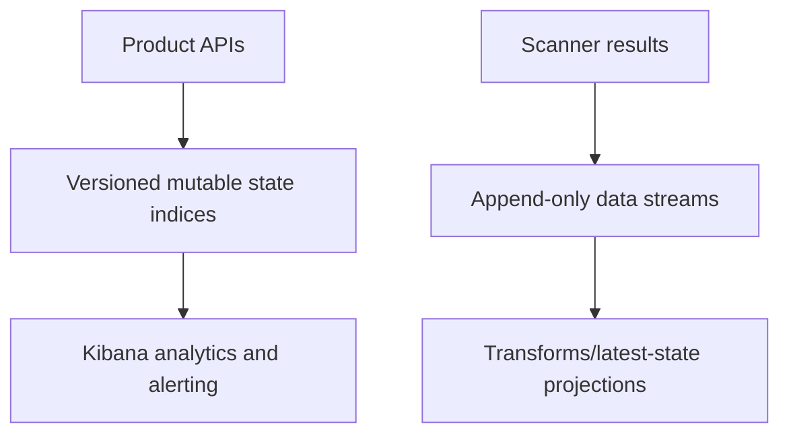

# Elasticsearch storage and migrations

Migration `0001_product_foundation` creates state index `dataobs-system-migrations-v1`, product state indices, read/write aliases, data-stream templates, and latest-state transform definitions. Production readiness fails until required migrations are applied.
