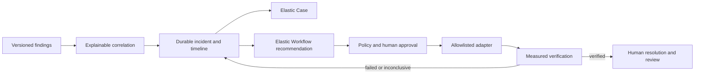

# Incident and Automation Workbench

> DataObs owns incident intelligence, policy, approvals, verification and the operator experience. Elastic Cases owns collaborative Case records and external Case synchronization. Elastic Workflows owns declarative runbook execution when available. DataObs does not duplicate a generic workflow engine.

Provider success and measured recovery are separate states. Resolved and closed are separate human-controlled lifecycle states. Recommendations never auto-start and capability failures are represented honestly.
