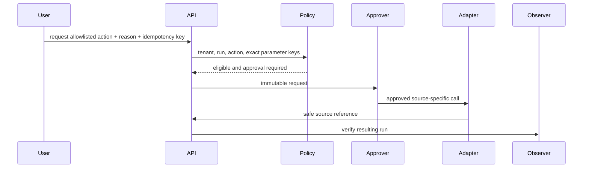

# Job action safety

```mermaid
sequenceDiagram
 User->>API: request allowlisted action + reason + idempotency key
 API->>Policy: tenant, run, action, exact parameter keys
 Policy-->>API: eligible and approval required
 API->>Approver: immutable request
 Approver->>Adapter: approved source-specific call
 Adapter->>API: safe source reference
 API->>Observer: verify resulting run
```
No arbitrary URL, command, SQL, DAG configuration, Spark submission, destructive or autonomous remediation is accepted.
