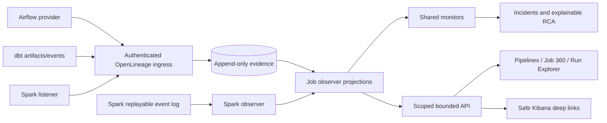

# Job and run observability

> OpenLineage provides the portable job and lineage event contract. Platform-native metadata provides deeper operational evidence. DataObs combines both without exposing source credentials or raw business data.

Canonical identity includes tenant, environment, platform, namespace and name; source run IDs are integration-namespaced. Platform facets remain optional typed objects. Append-only evidence is never replaced by current-state projection. Raw SQL, rows, Kafka payloads, offsets, stack traces and credentials are excluded or reduced to redacted fingerprints/references.
