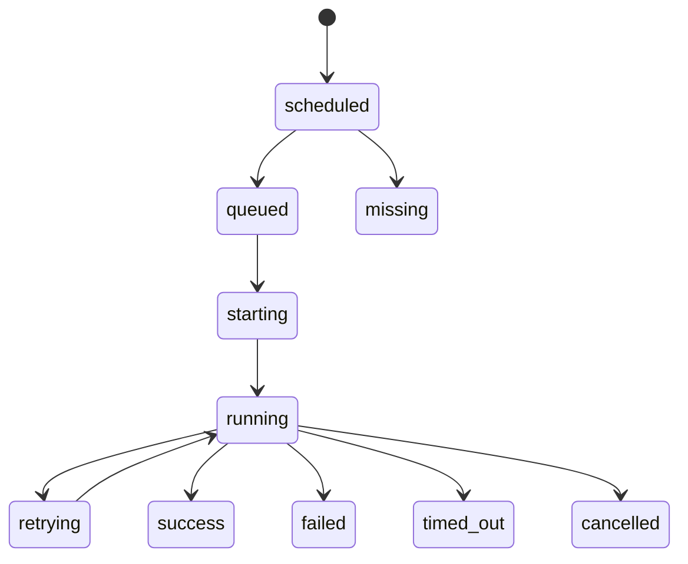

# Job/run state machine

Late START cannot regress a terminal projection. Duplicate events are idempotent. Conflicting terminal states retain the first deterministic projection unless an explicitly authorized correction is recorded; raw evidence remains append-only.
