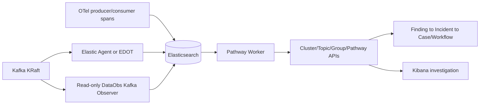

# Kafka Data Streams Monitoring

> This is a first vertical slice, not a production-readiness claim.

DataObs treats Elasticsearch as the system of record, OTel messaging spans as client telemetry, and Kibana as the investigation surface. Kafka remains the streaming platform. Elastic Observability Streams is optional, feature-flagged operational-log routing/enrichment and does not replace DataObs Data Streams Monitoring.

## Ownership and duplicate prevention

Exactly one authoritative provider is selected for each of broker, topic, partition, consumer-group, client, configuration, offset, Schema Registry, Kafka Connect, pathway and log capabilities. Startup rejects two selected providers unless explicit comparison mode is enabled. Elastic Agent/EDOT own selected base metrics; Observer owns Kafka Admin inventory and product projections. Projections reference raw documents rather than copying raw datasets.

## Safety

No payloads are read or stored. Keys are SHA-256 hashed by default. Operations are metadata-only and all identity includes tenant/environment. Streams and Streams workflow steps default off. Workflows only recommend safe runbooks; any allowlisted webhook remains disabled, approval-gated, idempotent, audited, and dry-run capable.
