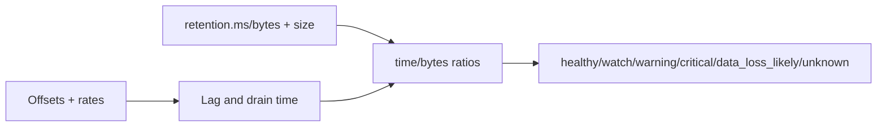

# Kafka lag and retention risk

`lag=max(0, latest-committed)`. Lag time uses next-unread timestamp (optional Read ACL), then consume rate, then production rate, otherwise unknown. Each estimate records method and confidence.

Reasons and source inputs accompany every result; low-confidence estimates are never presented as exact.
