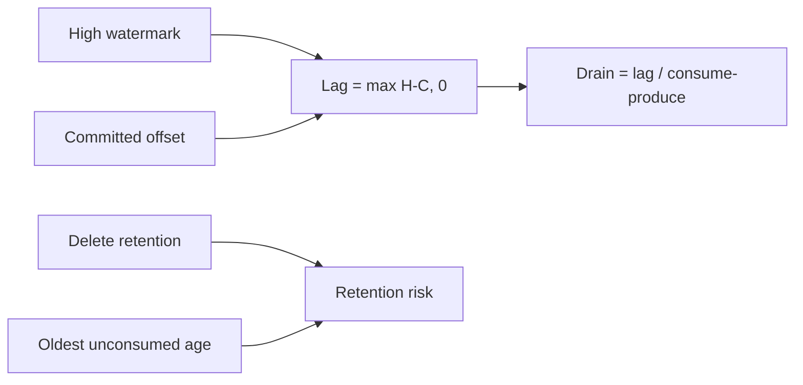

# Lag, drain time, and retention risk

Missing or stale offsets yield unknown/partial/stale values, never zero. Lag velocity uses time-ordered samples and exposes interval and count. Drain time is rounded to avoid false precision; a zero or negative net drain rate is `not_converging`. Delete-retention risk compares safely observed age to retention and checks whether committed offset precedes log start. Compact-only topics are `not_applicable` for this simplistic time deletion model. All results expose method, evidence, confidence, missing inputs, and whether evidence is measured, derived, or estimated.
