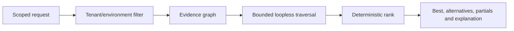

# Path search and ranking

Path search operates only after tenant and environment isolation. It enumerates deterministic loopless paths with bounded hops, returned alternatives, and a hard work cap. Cycles are avoided by retaining the node IDs in each candidate.

Ranking is the documented mean of evidence confidence, completeness, recency, health, inverse path length, business relevance, active traffic and SLO coverage. Missing factors remain explicit; no AI model participates. Structural metadata is never promoted to pipeline lineage without independent evidence.
