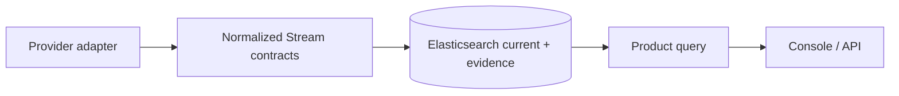

# Provider-neutral stream model

Kafka is the only available adapter. Kinesis, SQS, RabbitMQ, Google Pub/Sub, Pulsar, Azure Event Hubs and Azure Service Bus expose `not_implemented`; capability responses cannot imply collection. Kafka-specific controller, topic, partition, group, connector and schema attributes live in optional facets. Every product state carries status, observation time, coverage, confidence, warnings and evidence.

Elastic Streams manages operational log onboarding. DataObs Stream 360 manages message-broker and queue pathways, offsets, lag, retention risk, schemas, connectors and producer/consumer reliability. These are complementary capabilities and must not be conflated.
