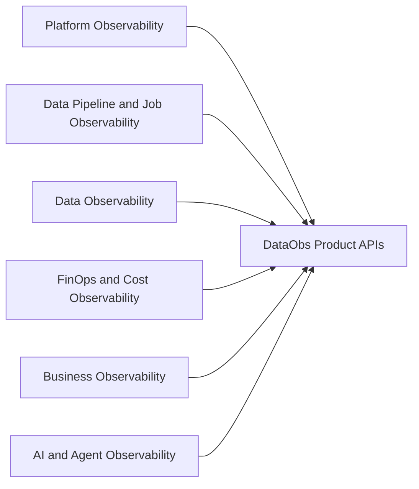

# Six-pillar product model

Canonical values are `platform`, `data_pipeline`, `data`, `finops_cost`, `business`, and `ai_agent`. Deprecated aliases are `full_stack -> platform` and `pipeline -> data_pipeline`.
