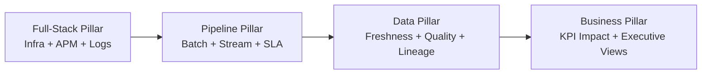

# DataObs Architecture Diagram and Detailed Runtime Flow

This document provides a deployable architecture view of DataObs and explains how signals move from source systems to incidents and business impact dashboards.

## 1) End-to-end architecture diagram

```mermaid
flowchart TB
    subgraph Sources[Cloud & Data Sources]
        APP[Apps / APIs]
        K8S[Kubernetes / Hosts]
        PIPE[Airflow / Glue / EMR / dbt]
        DATA[RDS / S3 / Warehouse / Kafka]
    end

    subgraph OTel[OpenTelemetry Layer]
        SDK[OTEL SDK + Auto Instrumentation]
        COL[OTEL Collector\n(embedded or existing enterprise)]
    end

    subgraph Core[DataObs Core Services]
        API[DataObs API]
        QLT[Quality Engine\n(checks + freshness)]
        LIN[Lineage Engine]
        MLM[ES ML Manager]
        ALR[Alert Manager]
    end

    subgraph Elastic[Elasticsearch + Kibana]
        ES[(Elasticsearch Cluster)]
        KB[Kibana Dashboards]
        MLI[ML Jobs/Datafeeds\n(.ml-anomalies-*)]
    end

    subgraph ITSM[Incident & Notification]
        SNOW[ServiceNow]
        PD[PagerDuty/Slack/Email]
    end

    APP --> SDK
    K8S --> SDK
    PIPE --> SDK
    DATA --> QLT

    SDK --> COL
    COL --> ES

    API --> ES
    QLT --> ES
    LIN --> ES
    MLM --> ES
    ES --> MLI

    ES --> KB
    ES --> ALR
    ALR --> SNOW
    ALR --> PD

    QLT --> ALR
    LIN --> ALR
```

## 2) Pillar mapping diagram



## 3) Detailed runtime flow (step-by-step)

### A. Telemetry ingestion path
1. Services, jobs, and platforms emit traces/metrics/logs via OpenTelemetry SDK or collectors.
2. OpenTelemetry Collector receives OTLP, enriches metadata (env, team, service), batches payloads, and exports to Elasticsearch.
3. Elasticsearch stores telemetry in DataObs indices (`dataobs-metrics`, `dataobs-logs`, `dataobs-traces`).

### B. Data quality and freshness path
1. Quality Engine reads DataObs rule config and schedules checks.
2. Checks execute against datasets (nulls, uniqueness, referential integrity, value ranges, row counts, freshness windows).
3. Results are indexed into quality/freshness indices in Elasticsearch.
4. Breaches emit OTEL metrics and trigger alert evaluation.

### C. Lineage and impact path
1. Lineage Engine ingests lineage metadata from dbt/Glue/Airflow/manual registrations.
2. Nodes and edges are stored in Elasticsearch lineage indices.
3. On schema or quality incidents, impact analysis resolves upstream/downstream blast radius.

### D. Elasticsearch ML anomaly path
1. DataObs ES ML manager creates/maintains ML jobs and datafeeds.
2. Jobs analyze target fields (example: `age_seconds`, `row_count`) using bucketed detectors.
3. Anomaly records are written to `.ml-anomalies-*`.
4. DataObs queries top anomalies and correlates with quality/lineage context.

### E. Alerting and ITSM path
1. Alert manager receives direct rule failures and anomaly candidates.
2. Severity and routing policy map events to channels.
3. ServiceNow incidents are created for `critical/high` (or as configured).
4. Incidents link to runbooks, affected datasets, and downstream impact list.

### F. Business observability path
1. KPI dashboards consume incident metadata + telemetry trends.
2. Stakeholders can correlate incidents with KPI drops, latency spikes, or pipeline delays.
3. Post-incident review captures MTTR, recurrence, and contract compliance.

## 4) Deployment modes

### Mode 1 — Embedded stack
- DataObs deploys OTEL Collector + Elasticsearch + core services.
- Good for sandbox, PoC, and small team environments.

### Mode 2 — Enterprise integration mode
- Reuse existing OTEL collectors and Elasticsearch clusters.
- DataObs runs API + quality + lineage + alerting services only.
- Recommended for regulated production environments.

## 5) Failure-domain behavior
- If collectors are unavailable, services continue locally and retry telemetry export.
- If Elasticsearch is degraded, checks can still run but indexing/alert enrichment may be delayed.
- If ServiceNow is unavailable, events can be routed to fallback channels (PagerDuty/Slack/Email).

## 6) Suggested production SLOs
- OTEL ingest latency p95 < 60s
- Freshness critical checks on schedule >= 99%
- Alert delivery success >= 99.9%
- Mean time to acknowledge (MTTA) < 10m for critical incidents
