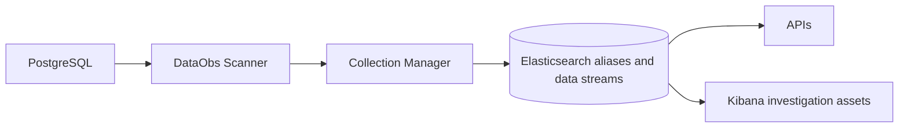

# PostgreSQL vertical slice demo

This demo runs PostgreSQL, Elasticsearch 9.4.2, Kibana, the DataObs API and the scanner. It validates the Elasticsearch-native flow from scanner metadata collection to current-state APIs and append-only investigation streams.

Passwords are supplied only as `env://`, `file://` or `k8s-file://` references and are redacted before API, task, log or Elasticsearch persistence.
