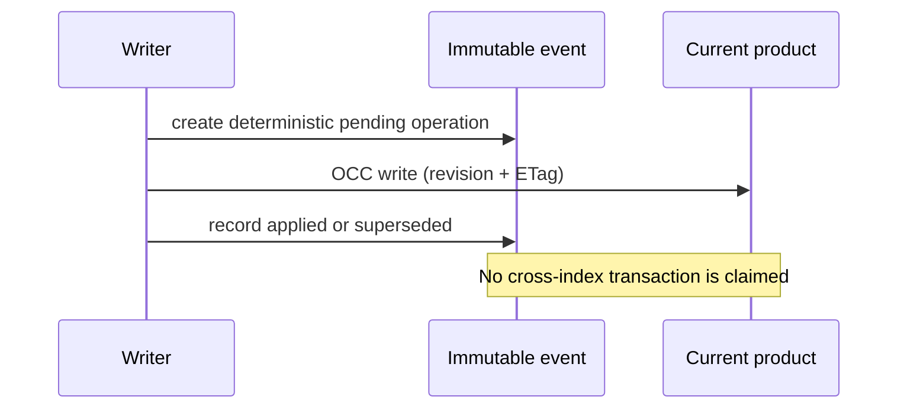

# Data Product 360 completion audit

> A Protocol, in-memory adapter, embedded list, or reliability helper is not a complete Data Product capability.

Release readiness remains **blocked** until hosted Elasticsearch 9.4.2, browser, axe, and security evidence is attached to the draft PR. PR #114 is present in the base history at `8f4443a`; migrations 0001–0013 are treated as immutable.

| Capability | Existing implementation | Missing production surface | Implementation | Evidence |
|---|---|---|---|---|
| Identity and isolation | scoped domain identity | production persistence | hashed tenant/environment IDs and filtered reads | unit/integration gate pending |
| Revisions, ETags, lifecycle | basic revision and ETag | lifecycle rules and durable audit | OCC repository; immutable revisions; one-step transitions | unit tests |
| Outputs and CRUD | embedded outputs | bounded authoritative validation | typed outputs, duplicate rejection, activation preconditions | unit tests |
| Cursors | memory cursor | signed API cursor | stable repository sort; API signing remains blocked | security gate pending |
| Membership and proposals | embedded member list | durable review workflow | bounded proposal models and 0014 resources | integration gate pending |
| Dependencies and cycles | service DFS | reusable bounded graph | deterministic traversal/cycle rejection | unit tests |
| SLOs | embedded minimal SLO | definitions and immutable evaluations | typed definitions/evaluations and evidence-honest evaluator | unit tests |
| Reliability and coverage | weighted helper | history and coverage projection | finite bounded scoring; missing/stale split; 0007 projection reused | unit tests |
| Incidents, changes, impact | partial query projections | Product-scoped aggregation | bounded typed summaries/impact contracts | integration gate pending |
| API/OpenAPI/client | none | complete route family | not promoted; release remains blocked | gate pending |
| Console/browser/accessibility | none | list and Product 360 | not promoted; release remains blocked | gate pending |
| Elasticsearch | 0007 resources | production writer and audit resources | 0014 resources plus Elasticsearch OCC repository | real-stack gate pending |
| Security/hosted CI | generic controls | vertical threat tests and hosted run | threat model defined; no hosted evidence claimed | hosted gate pending |

## Consistency

RCA, Job/Run Explorer, FinOps, enterprise IAM, remediation execution, and autonomous remediation are explicitly out of scope. Explainable RCA remains the next milestone.
