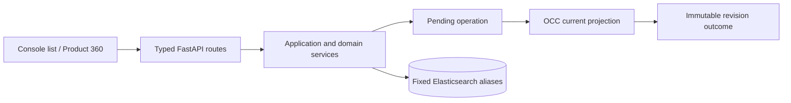
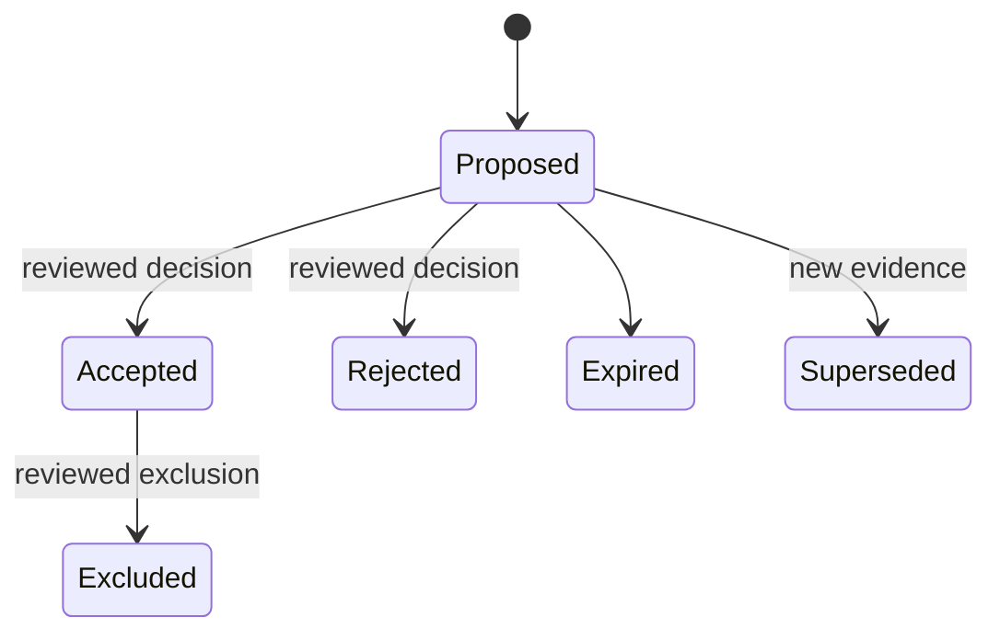
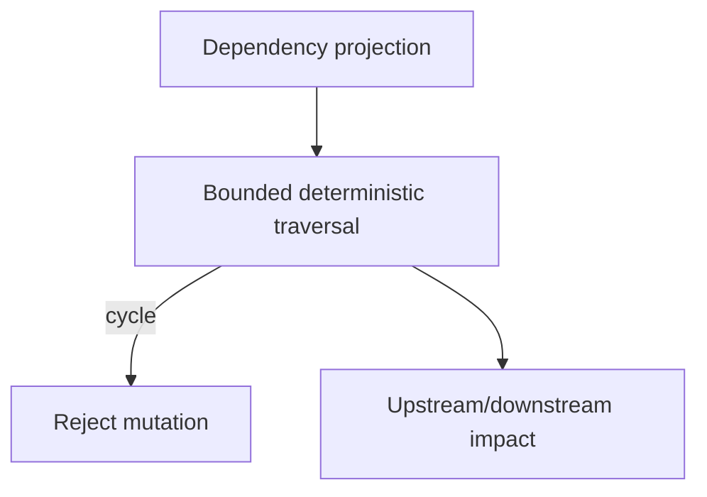
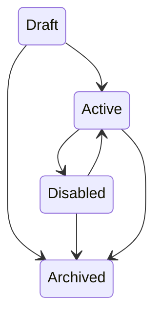

# Data Product API, Console, and evidence completion audit

> PR #116 corrected persistence safety and mapping correctness. It did not complete the Data Product product surface until the workflows, API, Console and retained evidence in this PR exist.

Migrations `0001` through `0015` remain immutable. The `0015_data_product_360_productization` resources cover the audited writers, so this change adds **no migration 0016**. Release readiness remains **blocked**. Hosted CI evidence has not been claimed without a real run URL.

| Capability | Current implementation | Missing production behavior | Implementation in this PR | Evidence |
|---|---|---|---|---|
| product CRUD | Event-first service and Elasticsearch OCC | Typed boundary | Typed list/create/get/update routes | unit and OpenAPI checks |
| lifecycle | Legal non-destructive transitions | HTTP actions | activate/deprecate/archive actions with ETag | lifecycle tests |
| revisions and reconciliation | Pending-before-state operation evidence | operational UI | authoritative scoped contract retained | product tests |
| list filters | bounded query inputs | projection-backed filtering | typed bounded API parameters | OpenAPI |
| cursor security | raw continuation previously used | opaque scope binding | versioned HMAC codec binds route, scope, filters and expiry | cursor tests |
| memberships | mapping exists | complete production workflow/API/UI | contract only; remains blocked | no certification claim |
| manual member add | domain model exists | durable action | contract only; remains blocked | no certification claim |
| proposal generation | model/mapping exists | evidence adapters | contract only; remains blocked | no certification claim |
| proposal acceptance/rejection | readiness mapping exists | durable workflow | contract only; remains blocked | no certification claim |
| exclusion | membership state exists | durable workflow | contract only; remains blocked | no certification claim |
| decision audit | strict mapping exists | complete UI | contract only; remains blocked | no certification claim |
| dependency persistence | strict projection mapping | repository writer/query | scoped authoritative contract | mapping audit |
| dependency traversal | deterministic bounded helper | persisted graph adapter | retained bounded traversal and cycle rejection | unit tests |
| cycle detection | deterministic helper | production repository integration | validated before product mutation | unit tests |
| SLO definitions | model/strict mapping | full repository/application API | authoritative scoped contract | mapping audit |
| SLO revision lifecycle | immutable resources | full lifecycle service | authoritative scoped contract | no certification claim |
| SLO evaluation persistence | scoped identity and mapping | full worker integration | authoritative scoped contract | evaluator tests |
| SLO replay | deterministic corrected-evidence identity | persisted projection | identity rules retained | unit tests |
| reliability current/history | honest formula | full persistence workflow | authoritative scoped contract | reliability tests |
| coverage | domain projection | full calculation/persistence | authoritative scoped contract | no certification claim |
| incidents | console projections | product summarizer | bounded contract | no certification claim |
| changes | evidence model | product summarizer | bounded contract | no certification claim |
| impact | domain projection | full persistence service | bounded contract | no certification claim |
| API | none | remaining workflow routes | typed product/lifecycle routes | OpenAPI generation |
| OpenAPI | generated root artifact | regeneration after route composition | generated from FastAPI | drift check |
| generated client | openapi-typescript | regeneration | generated schema workflow retained | drift check |
| Console list | absent | action dialogs and full projections | accessible API-backed list, filters and states | typecheck/build |
| Product 360 | absent | workflow actions and section endpoints | lazy route, URL tabs, honest unavailable states | typecheck/build |
| browser | no Data Product suite | production Playwright journeys | remains blocked | no hosted claim |
| accessibility | no retained axe report | full axe matrix | semantic table, tabs, status and alerts | local checks only |
| security | PR #116 mapping controls | end-to-end matrix | signed cursor and trusted-scope API boundary | threat model |
| Elasticsearch | 9.4.2 resources in 0015 | full integration matrix | no schema mutation | migration check |
| hosted CI | unavailable in local environment | run URL/artifacts | remains blocked | no evidence claimed |

## Architecture

## Readiness decision

The Console intentionally renders unavailable sections as unavailable and reliability without evidence as **unknown**, never healthy. Production membership, SLO persistence, browser/axe certification, Elasticsearch 9.4.2 integration, and hosted artifact retention still require evidence; therefore capability validation and production readiness are not promoted. Durable explainable RCA remains the next milestone only after these blockers close.
