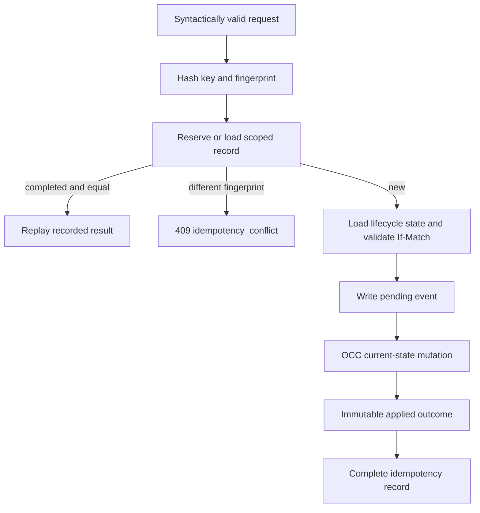

# Data Product membership and dependency completion audit

> PR #118 propagated the idempotency key but did not replay completed lifecycle operations before lifecycle and ETag validation. This PR closes that P1 defect and completes the membership and dependency product slice.

This focused audit is evidence-led. A row remains **blocked** until its required real-stack or hosted evidence exists. Migrations `0001`–`0015` are sufficient; no migration `0016` is required. The lifecycle fingerprint includes the actor, because replaying an operation under another audit principal is not semantically identical. Only a SHA-256 key digest is stored. Records expire after 30 days by default, retaining completed records for audit during that interval.

| Capability | Current state | Required implementation | Test | Hosted job | Evidence |
|---|---|---|---|---|---|
| lifecycle idempotency replay | implemented | replay before state/ETag validation | `test_completed_lifecycle_replays_before_state_and_etag_validation` | data-product-unit | local test |
| idempotency reservation | implemented | scoped create-or-load | unit + ES strict write | data-product-elasticsearch | pending hosted run |
| request fingerprint | implemented | canonical scope/body/actor/reason/ETag digest | unit/property | data-product-security | pending hosted run |
| completed result replay | implemented | return recorded revision result | unit/integration | data-product-elasticsearch | pending hosted run |
| pending operation replay | partial | reconciliation lease and repair | concurrency/integration | data-product-elasticsearch | blocked |
| conflicting key reuse | implemented | 409 domain conflict | unit/security | data-product-security | local test |
| revision listing | partial | typed signed pages in Elasticsearch/API | integration | data-product-elasticsearch | blocked |
| operation reconciliation | partial | bounded OCC reconciler and checkpoint | concurrency/integration | data-product-elasticsearch | blocked |
| signed product cursor | implemented | route/filter binding | cursor tests | data-product-contracts | local tests |
| signed membership cursor | partial | page integration | API/integration | data-product-contracts | blocked |
| signed proposal cursor | partial | page integration | API/integration | data-product-contracts | blocked |
| signed decision cursor | partial | page integration | API/integration | data-product-contracts | blocked |
| manual membership | typed | persistent event-first workflow | integration/browser | data-product-browser | blocked |
| lineage proposal generation | blocked | bounded existing-evidence adapter | unit/browser | data-product-browser | blocked |
| dependency proposal generation | blocked | bounded dependency evidence adapter | unit/browser | data-product-browser | blocked |
| accept proposal | blocked | event-first decision workflow | concurrency/integration | data-product-elasticsearch | blocked |
| reject proposal | blocked | immutable decision | concurrency/integration | data-product-elasticsearch | blocked |
| exclude membership | blocked | OCC projection plus audit | concurrency/integration | data-product-elasticsearch | blocked |
| decision audit | typed | create-only persistence and page | integration/browser | data-product-browser | blocked |
| dependency persistence | partial | strict current projection and removal events | integration | data-product-elasticsearch | blocked |
| dependency cycle validation | implemented in domain | validate complete scoped graph | unit/integration | data-product-unit | local test |
| direct upstream/downstream | partial | fixed-alias scoped query | integration | data-product-elasticsearch | blocked |
| transitive upstream/downstream | partial | bounded deterministic traversal | unit/integration | data-product-elasticsearch | local domain test |
| graph truncation | implemented in domain | expose typed API metadata | unit/browser | data-product-browser | local domain test |
| impact summary | blocked | typed dependency context | API/browser | data-product-browser | blocked |
| API | partial | membership/dependency/revision routes | contract | data-product-contracts | blocked |
| OpenAPI | partial | regenerate after routes | drift check | data-product-contracts | blocked |
| generated client | partial | regenerate after OpenAPI | drift/typecheck | data-product-contracts | blocked |
| Members tab | blocked | API-backed accessible workflow | Playwright/axe | data-product-browser | blocked |
| Lineage tab | blocked | existing lineage evidence UI | Playwright/axe | data-product-browser | blocked |
| Dependencies tab | blocked | bounded graph and table | Playwright/axe | data-product-browser | blocked |
| Revisions tab | blocked | immutable operation page | Playwright/axe | data-product-browser | blocked |
| Elasticsearch | blocked | run all strict mappings on 9.4.2 | integration | data-product-elasticsearch | no hosted URL |
| browser | blocked | required journeys | Playwright | data-product-browser | no hosted URL |
| axe | blocked | serious/critical gate | axe | data-product-browser | no hosted URL |
| security | partial | executable abuse/leakage suite | security tests | data-product-security | blocked |
| hosted CI | blocked | retained manifest and real run URL | workflow | data-product-summary | no hosted URL |

## Lifecycle ordering

Release readiness remains **blocked**. The next milestone remains **Data Product SLOs, reliability and coverage**, followed by **durable explainable RCA**.
