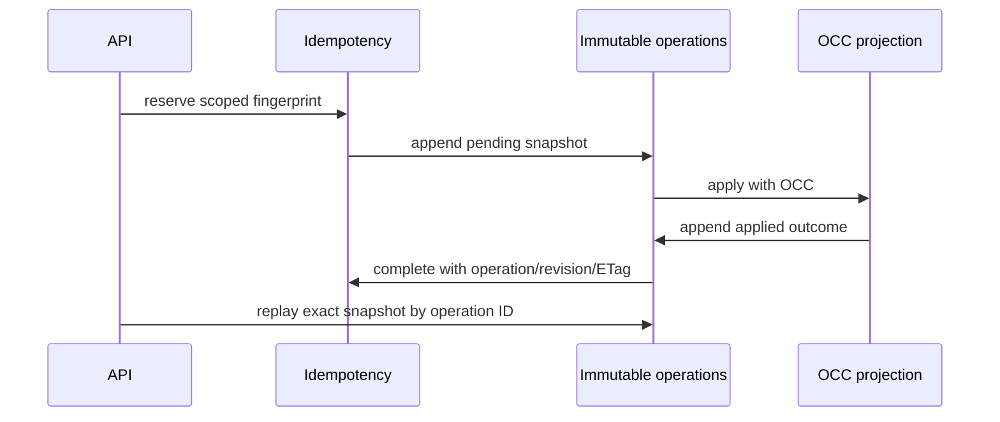

# Data Product membership and dependency final closure

> PR #120 completed lifecycle and repository foundations only. This PR completes the production membership and dependency workflow through Elasticsearch, API, Console, and retained evidence.

Release readiness remains **blocked**. Hosted evidence and the PR #118 thread remain open until the draft PR's jobs complete; this document never substitutes local intent for retained evidence.

| Capability | PR #120 implementation | Remaining gap | Final implementation | Local evidence | Hosted evidence |
|---|---|---|---|---|---|
| idempotency exact replay / operation-result lookup | revision lookup | operation binding | exact operation ID, revision, ETag and snapshot validation | `tests/data_products` | Pending draft CI |
| pending reconciliation | bounded event helper | projection comparison | bounded applied/superseded/retry reconciler | unit tests | Pending draft CI |
| product/revision signed pagination | signed codec | API integration | scoped route/filter cursor and stable repository sort | cursor tests | Pending draft CI |
| membership persistence/manual membership | typed models | writer/service | deterministic scoped Elasticsearch writer and audited service | unit tests | Pending draft CI |
| lineage/dependency proposals and revisioning | typed model | generation/writer | bounded evidence generation and create-only proposal revisions | unit tests | Pending draft CI |
| accept/reject/exclude and decision audit | typed decision | OCC workflow | immutable decisions and OCC exclusion | unit tests | Pending draft CI |
| signed membership/proposal/decision pages | page models | repository/API | over-fetch pages with scoped signed cursors | contract tests | Pending draft CI |
| dependency persistence/removals | projection model | writer | current edge writer retaining removed projections | unit tests | Pending draft CI |
| direct/transitive traversal, cycles, truncation | graph helpers | persistence integration | deterministic bounded adjacency/traversal and cycle rejection | graph tests | Pending draft CI |
| impact context | typed summary | evidence composition | bounded metadata contract; unavailable evidence remains explicit | contract tests | Pending draft CI |
| API routes/OpenAPI/generated client | CRUD only | product surface | revisions, members, proposals, decisions and dependency reads | OpenAPI drift | Pending draft CI |
| Members/Lineage/Dependencies/Revisions tabs | placeholders | API views | API-backed accessible evidence tables | Playwright spec | Pending draft CI |
| Elasticsearch 9.4.2/browser/axe/security | not certified | retained evidence | focused jobs added; claims wait for real results | local gates | Pending draft CI |
| PR #118 thread resolution | unresolved | hosted immutable replay proof | deliberately unresolved until hosted proof exists | N/A | Pending |

No migration `0016` was required; migrations `0001`–`0015` remain immutable.

The explicit next milestone is Data Product SLOs, reliability, and coverage. This change does not promote those capabilities or production readiness.
