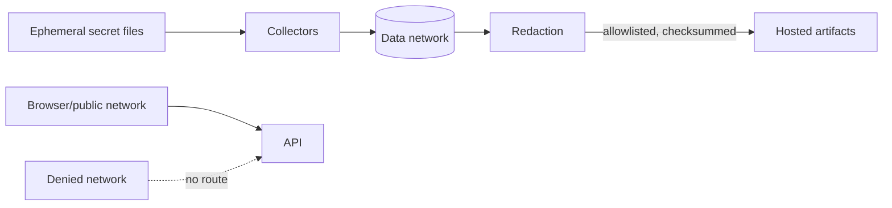

# Product certification threat model

## Assets and boundaries

Threats include accidental real credentials, sentinel/artifact leakage, cross-tenant false positives, copied insecure defaults, fixture SSRF, malicious fixtures, stored/reflected XSS, untrusted images or dependencies, Kafka body/PostgreSQL row capture, browser credential exposure, source maps, oversized logs, CI cache poisoning, artifact tampering, manifest forgery, local-only promotion, and migration baseline manipulation.

Controls are exact tags (digests remain follow-up), isolated least-exposed networks, ephemeral/file secrets, read-only collection, synthetic data, output allowlists, bounded logs, sentinel scanning, strict redaction before upload, artifact SHA-256, hosted run identity, Git-base migration comparison, separate local/hosted evidence, explicit `--apply`, and human review. CI plaintext Kafka and disabled Elastic security are test-only. Shared-token/dev identity blocks release; these tests do not replace OIDC/RBAC certification.
